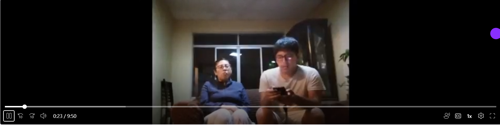
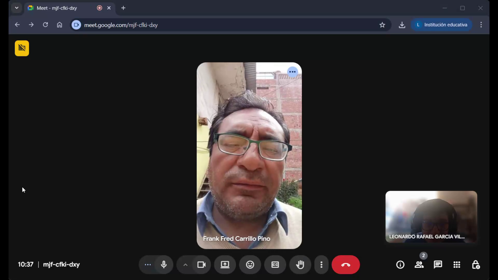
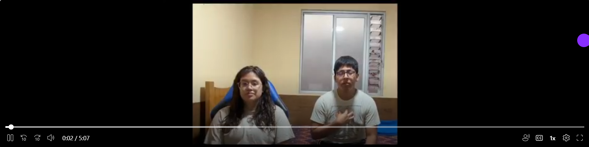
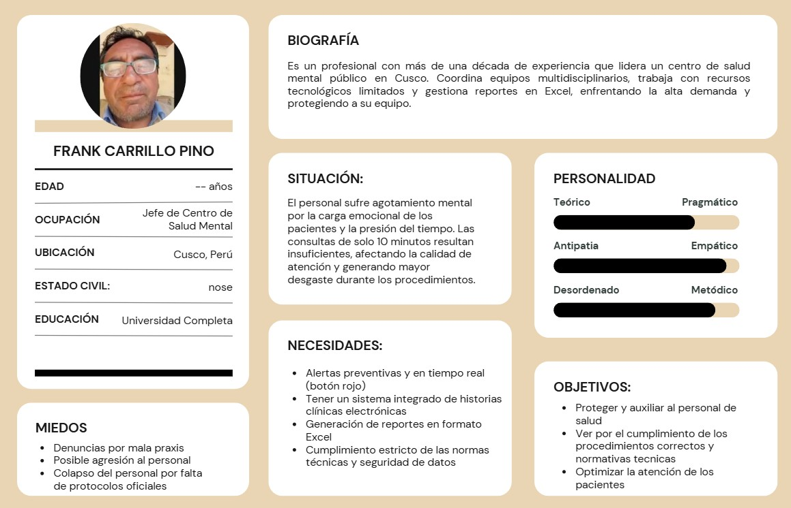
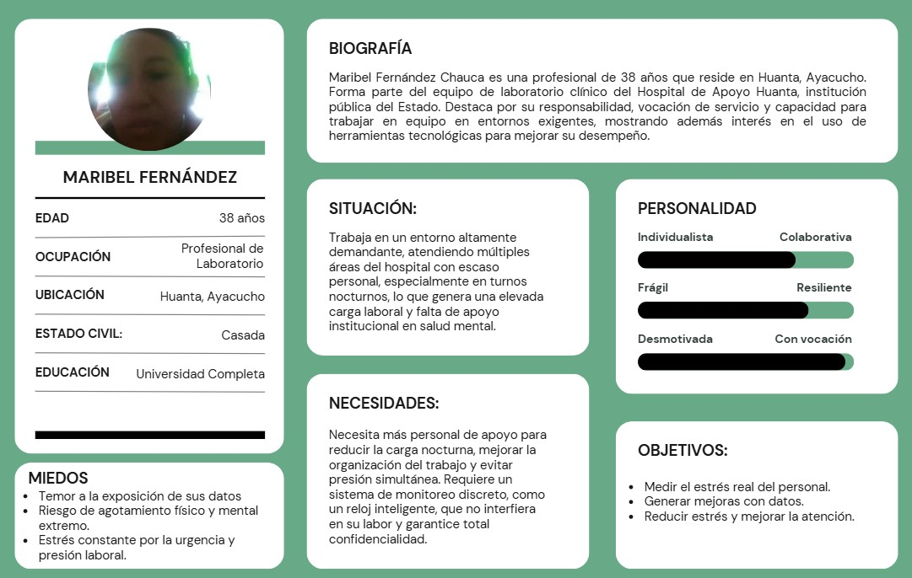
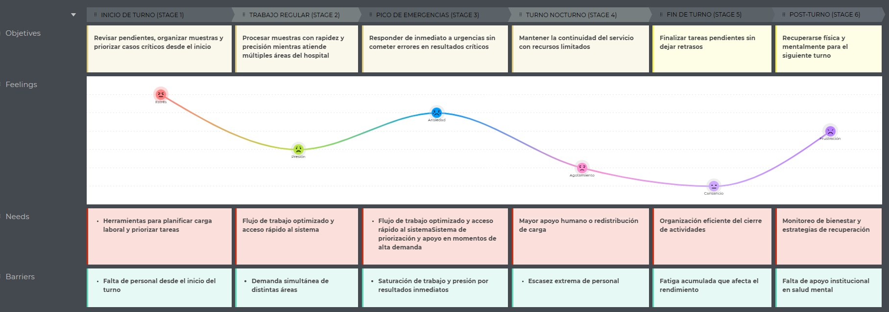
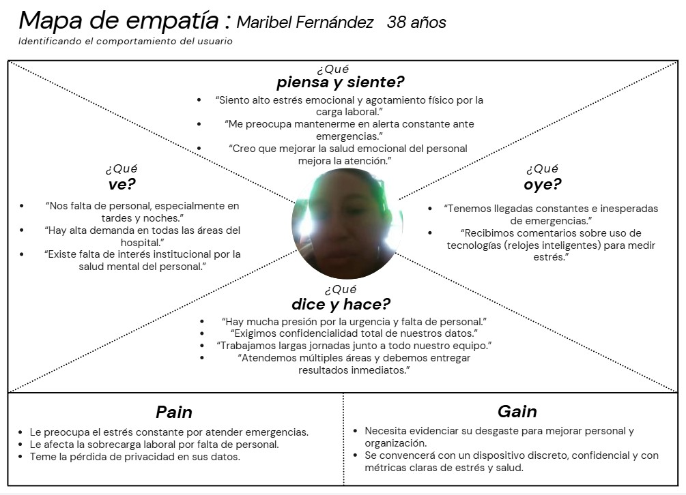
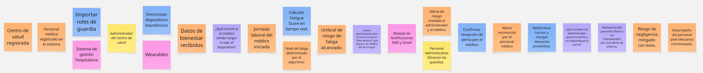

</img> 

<h3>Universidad Peruana de Ciencias Aplicadas</h3>
<h4>Facultad de Ingeniería</h4>
<h4>Carrera de Ingeniería de Software</h4>
<h4>Ciclo: 2026-10</h4>
<h4>Código y Nombre del Curso: 1ASI0729 - Desarrollo de Aplicaciones Open Source</h4>
<h4>NRC 17952</h4>
<h4>Docente: Ivan Robles Fernández</h4>
<h4>Informe del Trabajo Final</h4>
<h4>Startup: VitaSync</h4>
<h4>Producto: VitalWatch</h4>

#### Relación de integrantes 
| Integrante                              | Código     |
|---------------------------------|----------------|
| Montes Zamora, Edgar Alexander Mauricio | u20241e126 |
| Güere Calero, Fernando Julio            | u202413169 |
| León Morales, Johan Yonel               | u20231h055 |
| Garcia Villanueva, Leonardo Rafael      | u20231h059 |
| Lozano Leon, Richard Enrique            | u20241d990 |

 
<h3>Abril 2026</h3>
 

  

### Registro de Versiones del Informe

|**Versión**|**Fecha**|**Autor**|**Descripción de modificación**|
| - | - | - | - |
|1\.0|10/04/2026|Johan Yonel León Morales|Se agregó la estructura inicial del proyecto|
|1\.1\.1|10/04/2026|Johan Yonel León Morales|Se agregaron los perfiles de los integrantes del equipo|

  

# Project Report Collaboration Insights

URL de Organización de GITHUB del equipo VitaSync:
https://github.com/upc-pre-202610-1asi0729-17952-VitaSync

URL de Repositorio del Project Report: https://github.com/upc-pre-202610-1asi0729-17952-VitaSync/vitalwatch-report

<strong>*Entrega TB1:*</strong>

# Contenido

- [Contenido](#contenido)
- [Student Outcome](#student-outcome)
- [Capítulo I: Introducción](#capítulo-i-introducción)
  - [1.1. Startup Profile](#11-startup-profile)
    - [1.1.1. Descripción de la StartUp](#111-descripción-de-la-startup)
    - [1.1.2. Perfiles de integrantes del equipo](#112-perfiles-de-integrantes-del-equipo)
  - [1.2. Solution Profile](#12-solution-profile)
    - [1.2.1 Antecedentes y problemática](#121-antecedentes-y-problemática)
    - [1.2.2 Lean UX Process](#122-lean-ux-process)
      - [1.2.2.1 Lean UX Problem Statement](#1221-lean-ux-problem-statement)
      - [1.2.2.2 Lean UX Assumptions](#1222-lean-ux-assumptions)
      - [1.2.2.3 Lean UX Hypothesis Statements](#1223-lean-ux-hypothesis-statements)
      - [1.2.2.4 Lean UX Canvas](#1224-lean-ux-canvas)
  - [1.3. Segmentos Objetivo](#13-segmentos-objetivo)
- [Capítulo II: Requirements Elicitation \& Analysis](#capítulo-ii-requirements-elicitation--analysis)
  - [2.1. Competidores](#21-competidores)
    - [2.1.1. Análisis competitivo](#211-análisis-competitivo)
    - [2.1.2. Estrategias y tácticas frente a competidores](#212-estrategias-y-tácticas-frente-a-competidores)
  - [2.2 Entrevistas](#22-entrevistas)
    - [2.2.1 Diseño de entrevistas](#221-diseño-de-entrevistas)
    - [2.2.2 Registro de Entrevistas](#222-registro-de-entrevistas)
    - [2.2.3. Análisis de entrevistas](#223-análisis-de-entrevistas)
  - [2.3. Needfinding](#23-needfinding)
    - [2.3.1. User Personas](#231-user-personas)
    - [2.3.2 User Task Matrix](#232-user-task-matrix)
    - [2.3.3. User Journey Mapping](#233-user-journey-mapping)
    - [2.3.4. Empathy Mapping](#234-empathy-mapping)
  - [2.4. Big Picture Event Storming.](#24-big-picture-event-storming)
  - [2.5. Ubiquitous Language](#25-ubiquitous-language)
- [Capítulo III: Requirements Specification](#capítulo-iii-requirements-specification)
  - [3.1. User Stories](#31-user-stories)
  - [3.2. Impact Mapping](#32-impact-mapping)
  - [3.3. Product Backlog](#33-product-backlog)
- [Capítulo IV: Product Design](#capítulo-iv-product-design)
  - [4.1 Style Guidelines](#41-style-guidelines)
    - [4.1.1. General Style Guidelines](#411-general-style-guidelines)
    - [4.1.2. Web Style Guidelines](#412-web-style-guidelines)
  - [4.2. Information Architecture](#42-information-architecture)
    - [4.2.1. Organization Systems](#421-organization-systems)
    - [4.2.2. Labeling Systems](#422-labeling-systems)
    - [4.2.3. SEO Tags and Meta Tags](#423-seo-tags-and-meta-tags)
    - [4.2.4. Searching Systems](#424-searching-systems)
    - [4.2.5. Navigation Systems](#425-navigation-systems)
  - [4.3 Landing Page UI Design](#43-landing-page-ui-design)
    - [4.3.1. Landing Page Wireframe](#431-landing-page-wireframe)
    - [4.3.2. Landing Page Mock-up](#432-landing-page-mock-up)
  - [4.4 Web Applications UX/UI Design](#44-web-applications-uxui-design)
    - [4.4.1. Web Applications Wireframes](#441-web-applications-wireframes)
    - [4.4.2. Web Applications Wireflow Diagrams](#442-web-applications-wireflow-diagrams)
    - [4.4.3. Web Applications Mock-ups](#443-web-applications-mock-ups)
    - [4.4.4. Web Applications User Flow Diagrams](#444-web-applications-user-flow-diagrams)
  - [4.5. Web Applications Prototyping](#45-web-applications-prototyping)
  - [4.6. Domain-Driven Software Architecture](#46-domain-driven-software-architecture)
    - [4.6.1. Design-Level Event Storming.](#461-design-level-event-storming)
    - [4.6.2. Software Architecture Context Diagram](#462-software-architecture-context-diagram)
    - [4.6.3. Software Architecture Container Diagrams](#463-software-architecture-container-diagrams)
    - [4.6.4. Software Architecture Components Diagrams](#464-software-architecture-components-diagrams)
  - [4.7. Software Object-Oriented Design](#47-software-object-oriented-design)
    - [4.7.1. Class Diagrams](#471-class-diagrams)
  - [4.8. Database Design](#48-database-design)
    - [4.8.1. Database Diagrams](#481-database-diagrams)
- [Capítulo V: Product Implementation, Validation & Deployment](#capítulo-v-product-implementation-validation--deployment)
  - [5.1. Software Configuration Management](#51-software-configuration-management)
    - [5.1.1. Software Development Environment Configuration](#511-software-development-environment-configuration)
    - [5.1.2. Source Code Management](#512-source-code-management)
    - [5.1.3. Source Code Style Guide & Conventions](#513-source-code-style-guide--conventions)
    - [5.1.4. Software Deployment Configuration](#514-software-deployment-configuration)
  - [5.2. Landing Page, Services & Applications Implementation](#52-landing-page-services--applications-implementation)
    - [5.2.1. Sprint 1](#521-sprint-1)
      - [5.2.1.1. Sprint Planning 1](#5211-sprint-planning-1)
      - [5.2.1.2. Aspect Leaders and Collaborators.](#5212-aspect-leaders-and-collaborators)
      - [5.2.1.3. Sprint Backlog 1](#5213-sprint-backlog-1)
      - [5.2.1.4. Development Evidence for Sprint Review](#5214-development-evidence-for-sprint-review)
      - [5.2.1.5. Execution Evidence for Sprint Review](#5215-execution-evidence-for-sprint-review)
      - [5.2.1.6. Services Documentation Evidence for Sprint Review](#5216-services-documentation-evidence-for-sprint-review)
      - [5.2.1.7. Software Deployment Evidence for Sprint Review](#5217-software-deployment-evidence-for-sprint-review)
      - [5.2.1.8. Team Collaboration Insights during Sprint](#5218-team-collaboration-insights-during-sprint)
  - [5.3 Validation Interviews.](#53-validation-interviews)
    - [5.3.1 Diseño de entrevistas](#531-diseño-de-entrevistas)
    - [5.3.2 Registro de Entrevistas](#532-registro-de-entrevistas)
    - [5.3.3 Evaluaciones Según Heurísticas](#533-evaluaciones-según-heurísticas)
  - [5.4 Video About-the-Product](#54-video-about-the-product)
- [Conclusiones](#conclusiones)
- [Bibliografía](#bibliografía)
- [Anexos](#anexos)

# Student Outcome

El curso contribuye al cumplimiento del Student Outcome ABET:  
**ABET – EAC - Student Outcome 3** 
**Criterio:** Capacidad de comunicarse efectivamente con un rango de audiencias.  
En el siguiente cuadro se describe las acciones realizadas y enunciados de conclusiones por parte del grupo, que permiten sustentar el haber alcanzado el logro del ABET – EAC - Student Outcome 3.  

<table >
  <thead>
    <tr>
      <th colspan="3"><b>Criterio específico</b></th>
      <th colspan="3"><b>Acciones realizadas</b></th>
      <th colspan="3"><b>Conclusiones</b></th>
    </tr>
  </thead>
  <tbody>
    <tr>
	<td colspan="3">Comunica oralmente con efectividad a diferentes rangos de audiencia.</td>
      <td colspan="3" align = "justify">
      <h3>Montes Zamora, Edgar Alexander Mauricio</h3>
        <b>AV1</b>

        <b>TP1</b>

        <b>AV2</b>

        <b>TF1</b>

      <h3>Güere Calero, Fernando Julio</h3>
        <b>AV1</b>

        <b>TP1</b>

        <b>AV2</b>

        <b>TF1</b>

      <h3>León Morales, Johan Yonel</h3>
        <b>AV1</b>

        <b>TP1</b>

        <b>AV2</b>

        <b>TF1</b>

      <h3>Garcia Villanueva, Leonardo Rafael</h3>
        <b>AV1</b>

        <b>TP1</b>

        <b>AV2</b>

        <b>TF1</b>

      <h3>Lozano Leon, Richard Enrique</h3>
        <b>AV1</b>

        <b>TP1</b>

        <b>AV2</b>

        <b>TF1</b>

           
      </td>
      <td colspan="3">
        <b>AV1</b>

        <b>TP1</b>

        <b>AV2</b>

        <b>TF1</b>

      </td>
    </tr>
    <tr>
      <td colspan="3">Comunica por escrito con efectividad a diferentes rangos de audiencia.</td>
      <td colspan="3" align = "justify">
      <h3>Montes Zamora, Edgar Alexander Mauricio</h3>
        <b>AV1</b>

        <b>TP1</b>

        <b>AV2</b>

        <b>TF1</b>

      <h3>Güere Calero, Fernando Julio</h3>
        <b>AV1</b>

        <b>TP1</b>

        <b>AV2</b>

        <b>TF1</b>

      <h3>León Morales, Johan Yonel</h3>
        <b>AV1</b>

        <b>TP1</b>

        <b>AV2</b>

        <b>TF1</b>

      <h3>Garcia Villanueva, Leonardo Rafael</h3>
        <b>AV1</b>

        <b>TP1</b>

        <b>AV2</b>

        <b>TF1</b>

      <h3>Lozano Leon, Richard Enrique</h3>
        <b>AV1</b>

        <b>TP1</b>

        <b>AV2</b>

        <b>TF1</b>

		   
      </td>
      <td colspan="3">
        <b>AV1</b>

        <b>TP1</b>

        <b>AV2</b>

        <b>TF1</b>

      </td>
    </tr>
  </tbody>
</table>

# Capítulo I: Introducción
## 1.1 Startup Profile
### 1.1.1 Descripción de la Startup

**Nombre:** VitaSync 

**Área:** Salud 

VitaSync es una startup tecnológica centrada en el desarrollo de soluciones innovadoras para mejorar la seguridad y el bienestar dentro de las clínicas y hospitales.  

Nuestro producto VitalWatch es una plataforma web que permite monitorear el nivel de fatiga del personal médico mediante datos de su estado físico y carga laboral, analizando información como horas de sueño, frecuencia cardiaca, actividad física y turnos de trabajo para determinar el nivel de fatiga y generar alertas preventivas sobre los posibles riesgos al detectar niveles de fatiga elevados. Frente a ello buscamos ofrecer una solución accesible y confiable que permita a las instituciones de salud actuar con mayor anticipación y responsabilidad.  

Proponemos esto como respuesta a las problemas de la sobrecarga laboral, los turnos extensos y la falta de herramientas que permitan detectar a tiempo real el cansancio del personal clínico ya que esta situación puede afectar el rendimiento, la toma de decisiones y la salud de los pacientes.

* **Misión:** Nuestra misión es brindar a las clínicas y hospitales una herramienta inteligente que les permita monitorear la fatiga del personal clínico y detectar riesgos de forma temprana mejorando la seguridad y el bienestar en el entorno de trabajo.

* **Visión:** Nuestra visión es convertirnos en una startup líder en soluciones tecnológicas para la prevención de riesgos en el sector salud, siendo reconocida por ofrecer herramientas confiables, innovadoras y centradas en el bienestar del personal clínico y la seguridad de los pacientes.

* **Valores:** Responsabilidad, confianza, innovación y compromiso.

### 1.1.2 Perfiles de integrantes del equipo
  
| **Integrante**  | **Perfil**  | **Imagen** |
| -------------------------------------- | --------------------------------------------------------------------------------------------------------------------------------------------------------------------------------------------------------------------------------------------------------------------------------------------------------------------------------------------------------------------------------------------------------------------------------------------------------------------------------------------------------- | ---------------------------------------------------------------------------------------------------------------- |
| **Montes Zamora, Edgar Alexander Mauricio - u20241e126** | Buenas, soy Edgar Alexander Mauricio Montes Zamora, con codigo u20241e126 y actualmente estoy cursando el 5to ciclo de la carrera de Ingeniería de Software. Por el momento tengo conocimientos en programación como C++ y Python, además de saber HTML, CSS y también tener conocimientos en bases de datos SQL como Microsoft SQL Server. Considero que poseo habilidades blandas como la comunicación, trabajo en equipo o la adaptabilidad a distintos cambios que puedan presentarse tanto en proyectos como en otras situaciones, intento que en trabajos grupales todos puedan colaborar y ayudarse unos a otros, además de colaborar con ideas creativas.|  |
| **Güere Calero, Fernando Julio - u202413169** | Soy Fernando Julio Güere Calero (u202413169), estudiante del 5to ciclo de la carrera de Ingeniería de Software. Cuento con los conocimientos para programar en C++, Python y gestión de base de datos SQL. Además, tengo conocimiento para el desarrollo de páginas web usando HTML, CSS y JavaScript. Siempre estoy interesado en expandir mis conocimientos con otros lenguajes de programación para fortalecer mis competencias técnicas y enfrentar retos en la industria. |  |
| **León Morales, Johan Yonel - u20231h055** | Soy Johan Yonel León Morales, estudiante del 5to ciclo de la carrera de Ingeniería de Software, identificado con el código u20231h055. Cuento con conocimientos en programación en C++, así como en el desarrollo de interfaces web utilizando HTML, CSS y JavaScript. Mi enfoque se basa en el aprendizaje continuo y la atención al detalle, complementado con habilidades de comunicación, empatía y adaptabilidad. Estas competencias me permiten integrarme de manera efectiva en equipos de trabajo, aportar en el desarrollo de soluciones y colaborar activamente en el cumplimiento de los objetivos del proyecto. |  |
| **Garcia Villanueva, Leonardo Rafael - u20231h059** | Soy Leonardo Rafael Garcia Villanueva, con código u20231h059, actualmente estudiante en quinto ciclo de la carrera de Ingeniería de Software. Tengo conocimientos del lenguaje C++, asi como HTML, CSS y JavaScript. Me interesa resolver problemas que requieran de creatividad y pensamiento lógico mediante el desarrollo de software. En los trabajos en equipo frecuentemente busco resolver cualquier dificultad que se presente y me adapto rápidamente a las situaciones que se presentan. |  |
| **Lozano Leon, Richard Enrique - u20241d990** | Soy Richard Enrique Lozano León, con código U20241D990, estudiante de Ingeniería de Software en la Universidad Peruana de Ciencias Aplicadas, cursando el quinto ciclo. Me interesa fortalecer mis competencias en el área tecnológica y actualmente me encuentro enfocado en el aprendizaje y práctica del lenguajes de programación. |  |

## 1.2 Solution Profile

### 1.2.1 Antecedentes y problemática

Actualmente, es evidente que el agotamiento profesional es un fenómeno generalizado entre los profesionales de la salud. Este fenómeno se ha convertido en una evidente problemática en Perú, especialmente en los hospitales donde las exigencias laborales son altas y las jornadas de trabajo pueden llegar a durar más de 24 horas. Un estudio reciente realizado en un hospital de Tacna (NBR, 2023), muestra que los profesionales de la salud presentan una alta sensibilidad emocional, directamente relacionada con las exigencias de su trabajo, las largas jornadas y la presión constante de la atención al paciente.

En vista de este contexto, surge la necesidad de implementar soluciones que puedan ayudar a medir los niveles de agotamiento del personal medico de manera temprana, esto con el fin de prevenir posibles riesgos, mejorar las condiciones laborales y poder garantizar una atención eficiente y segura para los pacientes.

**5W's y 2H's**
 

* **What?**

Tanto en clínicas como en hospitales existe una problemática relacionada con la fatiga del personal clínico, producida por jornadas laborales extensas, turnos rotativos inesperados y altos niveles de estrés acumulados durante días. Esto afecta evidentemente al rendimiento del personal medico, lo cual puede aumentar el riesgo de errores durante la atención a pacientes, realización de documentos, etc. Actualmente, no se evidencia la presencia de aplicaciones que permitan medir y monitorear este nivel de fatiga en tiempo real de manera preventiva.
  
* **Why?**

El problema se origina principalmente por la sobrecarga laboral, una alta demanda de atención médica y una notoria falta de sistemas que permitan evaluar de forma objetiva el estado tanto físico como mental del personal clínico. Además, la gestión de turnos del personal se asigna sin tomar en cuenta la fatiga, lo que incrementa el riesgo de agotamiento del personal asignado y a su vez disminuye la calidad del servicio de salud.
  
* **Who?**

Los principales afectados serían el personal clínico, enfermeros y técnicos de salud, quienes estarían expuestos a largas jornadas de trabajo. Por lo que, de manera indirecta, también impacta al personal administrativo, quienes están encargados de la gestión hospitalaria, y no cuentan con herramientas para tomar decisiones informadas sin confirmación de un médico en plenitud de facultades. Finalmente, los pacientes también se pueden ver afectados, al correr el riesgo de posibles errores médicos.
  
* **When?**

Este problema si bien ocurre principalmente durante turnos prolongados, guardias nocturnas o jornadas laborales continuas sin de un descanso adecuado, también se intensifica durante situaciones de alta demanda, como emergencias médicas o temporadas con mayor carga hospitalaria.
  
* **Where?**

Esta problemática se presenta en hospitales, clínicas, centros de salud o postas médicas, especialmente en aquellas que están ubicadas en zonas urbanas o que tengan un flujo de pacientes elevado, donde el personal clínico enfrenta una mayor carga laboral y presión operativa.
  
* **How?**

Ocurre debido a una acumulación progresiva una acumulación de horas de trabajo, la falta de descanso adecuado ya sea por tiempo o por espacios, y niveles elevados de estrés. La ausencia de herramientas que le permitan al personal monitorear este problema lo que provoca que pase desapercibido hasta que los errores se manifiesten, la disminución del rendimiento o problemas de salud en el personal.
  
* **How much?**

El impacto es evidentemente significativo, al incrementar el riesgo de errores médicos, afecta la calidad con la que se brinda el servicio de salud y que puede generar consecuencias graves para los pacientes. Además, puede generar costos operativos para las mismas instituciones, como rotación de personal, disminución de productividad e incluso posibles responsabilidades legales derivadas de negligencias médicas.
  

### 1.2.2 Lean UX Process
#### 1.2.2.1 Lean UX Problem Statement

El problema se presenta en entornos hospitalarios donde médicos, enfermeros y doctores tienen jornadas de trabajo largas, con niveles elevados de estrés, descanso insuficiente, y en ocasiones sobrecarga laboral. Esta situación aumenta la probabilidad de fatiga, lo que puede perjudicar la concentración, la toma de decisiones críticas o el desempeño general del personal. A pesar de la gravedad de este problema, muchos centros de salud no cuentan con herramientas que permitan medir este riesgo en tiempo real ni tampoco anticiparse a sus consecuencias de manera preventiva.

Uno de los puntos críticos es que los supervisores y administrativos no suelen tienen una visión precisa y continua del estado de cansancio del personal, lo que dificulta una distribucion de turnos adecuada o la toma de decisiones oportunas. Además, el personal clínico solo dispone de su autopercepción para darse cuenta de su nivel de fatiga y no siempre podrán reconocer cuándo su estado podría representar un riesgo para los pacientes.

Por estas razones planteamos lo siguiente: ¿Cómo ayudar a las clínicas y hospitales a detectar el nivel de fatiga del personal clínico y posibles anomalías en sus datos de salud para prevenir errores médicos de forma accesible y personalizada?

#### 1.2.2.2 Lean UX Assumptions

 + **User Assumptions:** 

    + **¿Quién es el usuario?**   Hay dos grupos de usuarios, el primero está conformado por el personal administrativo de clínicas y hospitales, como directores, administradores, jefes de área o supervisores, y el segundo grupo está compuesto por el personal clínico, como médicos, enfermeros y técnicos de salud.  

    + **¿Dónde encaja nuestro producto en su trabajo o en su vida?**   En el trabajo al personal administrativo le facilita la gestión de turnos y le permite revisar el estado de fatiga, recibir alertas y tomar decisiones oportunas sobre el personal clínico de forma eficiente. Al personal clínico, le informa sobre su nivel de fatiga y ello les permite actuar antes de que afecte su desempeño o bienestar.  

    + **¿Cuándo y cómo se utiliza nuestro producto?**   Se utiliza durante los horarios de trabajo y su funcionamiento se basa en la recopilación de datos mediante un reloj inteligente o dispositivo portable que registre información como horas de sueño, frecuencia cardiaca, actividad física y presión en sangre. Cada médico puede visualizar sus propios datos, y a nivel administrativo se analizan los datos de todo el personal clínico y los supervisores pueden recibir alertas y gestionarlas cuando se detectan niveles elevados de fatiga o valores anómalos que podrían indicar un problema de salud adicional.  

    + **¿Qué problemas resuelve nuestro producto?**   Resuelve la falta de visibilidad sobre la fatiga del personal clínico en tiempo real y la dificultad que supone detectar riesgos antes de que se produzcan errores médicos. Además, ayuda a identificar datos anómalos que podrían sugerir la presencia de una condición o enfermedad no relacionada directamente con el cansancio.  

    + **¿Qué características son importantes?**   La visualización clara del estado de fatiga, el cálculo de un puntaje de fatiga, la generación de alertas, el historial de datos, la detección de patrones anómalos no relacionados al cansancio, la facilidad de uso para supervisores y personal clínico, y la seguridad en el manejo y guardado de la información sensible.  

    + **¿Cómo debe verse y comportarse nuestro producto?**   Debe verse profesional e intuitivo, con un dashboard legible, alertas visibles y una interfaz que permita facilitar la toma de decisiones. Debe comportarse como una herramienta eficiente que detecte riesgos, emita alertas y ayude a determinar las mejores decisiones.  

 + **Business Outcomes:** 

    1. **Creo que nuestros usuarios necesitan**   una forma confiable de detectar la fatiga antes de que perjudiquen el rendimiento y se conviertan en un riesgo crítico.  

    2. **Estas necesidades se pueden resolver con**   un servicio que recopile datos de sueño, frecuencia cardiaca, actividad y turnos de jornada laboral, y los convierta en un puntaje de fatiga confiable y que emita alertas preventivas.   

    3. **Nuestros usuarios iniciales son**   clínicas y hospitales pequeños o medianos que tienen un horario de apertura extenso y que necesiten mejorar la seguridad de su personal y de los pacientes.  

    4. **El valor #1 que un cliente quiere de nuestro servicio es que**   permita anticipar riesgos de fatiga y tomar decisiones oportunas para evitar errores médicos, incidentes laborales o una atención incompetente.  

    5. **El usuario también puede obtener beneficios adicionales como**   detectar datos anómalos que sugieran un posible problema de salud o enfermedad no relacionada al cansancio, lo que permitiría una revisión del estado del personal y asi actuar de forma temprana.  

    6. **Vamos a adquirir la mayoría de nuestros clientes a través de**   campañas de publicidad y ofertas personalizadas dirigidas directamente a clínicas y hospitales según su tamaño y necesidades.  

    7. **Haremos dinero a través de**   un modelo de suscripción aplicado a clínicas o centros médicos. La suscripción no se aplicará al personal médico, sino al centro clínico.  

    8. **Nuestras competencias principales en el mercado son**   Readi, Pulsar, SmartCap y Optalert. 

    9. **Los venceremos debido a que**   nuestro servicio esta ideado de para clínicas y hospitales con un enfoque preventivo mediante la detección de fatiga y anomalías de salud.  

    10. **Nuestro mayor riesgo es**   que las instituciones no nos adopten por temas de privacidad, costo o un posible rechazo del personal para utilizar dispositivos de monitoreo.  

    11. **Resolveremos esto a través de**   propuestas comerciales flexibles y personalizadas por institución que facilite la adopción progresiva, además de ofrecer una interfaz intuitiva y políticas transparentes de privacidad.  
    
    12. **¿Qué otras suposiciones tenemos?**   Las clínicas valorarán más el costo de la prevención antes que el costo de los accidentes o problemas ya generados.  

#### 1.2.2.3 Lean UX Hypothesis Statements
###### Hipótesis 1:
Creemos que si mostramos al personal administrativo un dashboard con el puntaje de fatiga del personal clínico y alertas en tiempo real estos podrán responder con mayor rapidez ante situaciones de riesgo y tomar decisiones con más seguridad, sabremos que hemos tenido éxito cuando el 80% del personal administrativo reporten haber identificado con mayor rapidez a los trabajadores en riesgo y tomado una decisión oportuna.

-   **Business Outcome:**   Incrementar los clientes de VitalWatch al reducir los incidentes asociados a fatiga y mejorar la seguridad operativa.  
    
-   **Users:**   Directores, administradores, jefes de área y supervisores.  
    
-   **User Outcome:**   Detectar rápidamente al personal fatigado y redistribuir turnos o tareas a tiempo.  
    
-   **Feature:**   Dashboard de monitoreo con puntajes de fatiga, alertas y estado del personal.  

###### Hipótesis 2:
Creemos que si mostramos al personal clínico datos relevantes sobre su estado de fatiga y su historial podrán reconocer de forma precisa su nivel de agotamiento y decidir si necesitan descanso, sabremos que hemos tenido éxito cuando el 70% del personal que haya tenido un puntaje de fatiga elevado reporte una mejoría en su desempeño y estado de salud físico.

-   **Business Outcome:**   Incrementar la cantidad de usuarios activos de VitalWatch fortaleciendo la prevención de riesgos laborales causados por la fatiga dentro del personal clínico.  
    
-   **Users:**   Médicos, enfermeros y técnicos de salud.  
    
-   **User Outcome:**   Comprender su estado físico de mejor manera y saber cuándo necesitan descanso.  
    
-   **Feature:**   Vista de monitoreo individual para visualizar el nivel de fatiga actual e historial de datos de los últimos días.  

###### Hipótesis 3:
Creemos que si emitimos alertas de datos anómalos tanto al personal administrativo como clínico podrán identificar a tiempo posibles problemas de salud que no estén relacionadas con el cansancio y tomar decisiones oportunas, sabremos que hemos tenido éxito cuando el 85% las alertas revisadas hayan generado alguna acción como seguimiento o revisión médica.

-   **Business Outcome:**   Incremento de la visiblidad de VitalWatch al fortalecer el valor diferencial mediante su capacidad de prevención adicional.  
    
-   **Users:**   Personal administrativo y clínico.  
    
-   **User Outcome:**   Detectar señales tempranas de posibles problemas de salud y tomar decisiones oportunas para su bienestar.  
    
-   **Feature:**   Módulo de detección de anomalías con alertas compartidas para supervisores y personal clínico en el dashboard.  

#### 1.2.2.4 Lean UX Canvas

<table>
    <tr>
        <td valign="top" >
            
  <b>Business Problem</b> 
 
            
 - En clínicas y hospitales no existe una forma clara de medir la fatiga del personal en tiempo real   
                - La falta de monitoreo preventivo incrementa el riesgo de errores médicos y afecta la seguridad de los pacientes
            

        </td>
        <td rowspan="2" valign="top">
            
 <b>Solutions</b> 
 
            
 - Dashboard de monitoreo a tiempo real   
                - Cálculo de puntaje de fatiga a partir de datos biométricos y de jornada de trabajo  
                - Alertas preventivas para el personal administrativo y clínico  
                - Detección de datos anómalos no relacionados con la fatiga que indiquen posibles problemas de salud
            

        </td>
            <td valign="top">
            
  <b>Business Outcomes</b> 
 
            
 - Incrementar los clientes de VitalWatch al reducir los incidentes asociados a fatiga y mejorar la seguridad operativa en clínicas y hospitales  
                - Incrementar la cantidad de usuarios activos de VitalWatch fortaleciendo la prevención de riesgos laborales causados por la fatiga  
                - Incremento de la visiblidad de VitalWatch al fortalecer el valor diferencial mediante su capacidad de prevención adicional.
            

            </td>
        </tr>
    <tr>
        <td valign="top">
            
 <b>Users</b>
 
            
 - Personal administrativo (directores, administradores y supervisores)   
                - Personal clínico (médicos, enfermeros y técnicos de salud)
            

        </td>
        <td valign="top">
            
 <b>User Outcomes & Benefits</b>
 
            
 - Detectar rápidamente al personal fatigado y redistribuir turnos o tareas a tiempo   
                - Comprender su estado físico de mejor manera y saber cuándo necesitan descanso   
                - Detectar señales tempranas de posibles problemas de salud y tomar decisiones oportunas para su bienestar
            

        </td>
    </tr>
    <tr>
        <td valign="top">
            
  <b>Hypotheses</b> 
 
            
 - Si mostramos al personal administrativo el puntaje de fatiga del personal clínico en tiempo real podrán responder con mayor rapidez ante situaciones de riesgo  
                - Si mostramos al personal clínico datos relevantes sobre su estado de fatiga podrán actuar antes de que su desempeño se vea afectado  
                - Si emitimos alertas de datos anómalos se podrán identificar a tiempo posibles problemas de salud que no estén relacionadas con el cansancio 
            

        </td>
        <td valign="top">
            
  <b>What’s the most important thing we need to learn first?</b> 
 
            
 - Saber si el personal administrativo realmente confiaría en el monitoreo de fatiga y entendería el puntaje mostrado  
                - Saber si el personal clínico vería el puntaje de fatiga como una herramienta de apoyo real  
                - Saber si las alertas de datos anómalos se percibirían como algo útil e importante
            

        </td>
        <td valign="top">
            
   <b>What's the least amount of work we need to do to learn the next most important thing?</b> 
 
            
 - Crear un prototipo funcional del dashboard con puntaje de fatiga y algunas alertas básicas.  
                - Simular datos para probar la detección de fatiga y los datos anomalos.
            

        </td>
    </tr>
</table>

## 1.3 Segmentos Objetivo

Los segmentos objetivo son grupos específicos de usuarios a los que se dirige un producto o servicio en particular.

Los segmentos objetivos identificados para nuestra plataforma VitalWatch, orientada al monitoreo del nivel de fatiga del personal médico, se presentan a continuación:
+ **S1: Personal administrativo de clínicas y hospitales** 
  + **Características demográficas:** 
    Edad: 30 a 60 años. 
    Género: Variado. 
    Cargo: Directores, administradores, jefes de área y supervisores de turnos. 
    Formación: Gestión hospitalaria o administración. 
    Tecnología: Uso frecuente de sistemas digitales. 
    Necesidad: Toma de decisiones y reducción de riesgos operativos. 

  + **Características geográficas:** 
    Ubicación: Clínicas y hospitales en zonas urbanas y semiurbanas. 
    Entorno: Instituciones con alta demanda y carga operativa.  

+ **S2: Personal clínico** 
  + **Características demográficas:** 
    Edad: 22 a 60 años. 
    Género: Variado. 
    Cargo: Médicos, enfermeros y técnicos de salud. 
    Condición laboral: Turnos prolongados o rotativos. 
    Tecnología: Uso básico/intermedio de sistemas hospitalarios. 
    Necesidad: Monitorear fatiga y prevenir agotamiento. 

  + **Características geográficas:** 
    Ubicación: Hospitales y centros de salud en zonas urbanas y semiurbanas. 
    Entorno: Alta carga laboral y demanda de atención.  

---

# Capítulo II: Requirements Elicitation & Analysis

## 2.1 Competidores

En esta sección se identificarán los mejores referentes para posteriormente realizar un análisis competitivo que nos ayudará a saber nuestro posicionamiento y el valor agregado que ofreceremos en el mercado. 

Según la investigación, se descubrieron apps webs y/o aplicaciones similares. Sin embargo, estamos considerando cuatro competidores directos o indirectos que se parezcan más a nuestra startup.

* **Readi** 

* **Smartcap** 

* **Pulsar Informatics** 

* **Optalert** 

### 2.1.1 Análisis Competitivo

En esta sección se realizará el análisis competitivo de los competidores identificados en la sección inicial con el objetivo de tener una idea más clara sobre nuestro producto frente a los competidores y aprender para mejorar nuestro producto.

<table>
	<thead>
		<tr><th colspan="7">Competitive Analysis Landscape</th></tr>
	</thead>
	<tbody>
		<tr>
			<td colspan="2">¿Por qué llevar a cabo este análisis?</td>
			<td colspan="5">Realizamos este análisis para detectar qué es lo que le falta a las soluciones actuales y asegurar que VitalWatch ofrezca algo único, pensado exclusivamente para el ritmo de un centro de salud. Conocer a fondo a la competencia nos ayuda a construir una herramienta que realmente proteja al personal médico y evite negligencias evitables por cansancio.</td>
		</tr>
		<tr>
			<td colspan="2">
				
Nombre

			</td>
			<td>
<b>VitalWatch</b>
</td>
			<td>
<b>Readi (Fatigue science)</b>
</td>
			<td>
<b>Smartcap</b>
</td>
			<td>
<b>Pulsar Informatics</b>
</td>
			<td>
<b>Optalert</b>
</td>
		</tr>
		<tr>
			<td colspan="2">
				
Logo

			</td>
			<td>

				
			
</td>
			<td>

				
			
</td>
			<td>

				
			
</td>
			<td>

				
			
</td>
			<td>

				
			
</td>
		</tr>
		<tr>
			<td rowspan="2">Perfil</td>
			<td>Overview</td>
			<td>Herramienta predictiva para que directores clínicos prevengan errores antes de que ocurran.</td>
			<td>IA que predice el riesgo de fatiga con 18 horas de antelación.</td>
			<td>Banda EEG que mide ondas cerebrales para detectar sueño al instante.</td>
			<td>Software que analiza horarios para hallar "huecos" peligrosos de sueño.</td>
			<td>Tecnología que mide el parpadeo para detectar somnolencia temprana.</td>
		</tr>
		<tr>
			<td>Ventaja Competitiva</td>
			<td>Algoritmo "Fatigue Score" que cruza biometría con carga laboral real.</td>
			<td>Predicción a largo plazo basada en tendencias históricas de sueño.</td>
			<td>Precisión del 94.7% al usar el estándar de oro médico (EEG).</td>
			<td>Validación por la NASA y el Departamento de Defensa de EE. UU..</td>
			<td>Detección de microsueños vital para cirugías de alta precisión.</td>
		</tr>
		<tr>
			<td rowspan="2">Marketing</td>
			<td>Mercado Objetivo</td>
			<td>Clínicas, hospitales y centros de salud especializados.</td>
			<td>Minería pesada, transporte y deportes de élite.</td>
			<td>Operadores de maquinaria pesada y minería a cielo abierto.</td>
			<td>Aerolíneas, defensa y redes hospitalarias académicas.</td>
			<td>Logística, automotriz y grupos de cirugía avanzada.</td>
		</tr>
		<tr>
			<td>Estrategias</td>
			<td>Enfoque humano: reducir estrés médico y evitar demandas legales.</td>
			<td>Liderazgo científico mediante estudios de "higiene del sueño".</td>
			<td>Pruebas de concepto directas en sitios de alto riesgo industrial.</td>
			<td>Cumplimiento normativo y estándares de seguridad gubernamental.</td>
			<td>Integración nativa en equipos médicos y vehículos de fábrica.</td>
		</tr>
		<tr>
			<td rowspan="3">Producto</td>
			<td>Servicios</td>
			<td>Dashboard predictivo, Fatigue Score y alertas en tiempo real.</td>
			<td>App Readi, análisis predictivo y consultoría técnica.</td>
			<td>LifeBand (wearable), pantallas de cabina y monitoreo nube.</td>
			<td>Fatigue Meter y herramientas de evaluación de horarios.</td>
			<td>Gafas inteligentes y cámaras infrarrojas de cabina.</td>
		</tr>
		<tr>
			<td>Precios</td>
			<td>Suscripción SaaS escalable por número de personal.</td>
			<td>Suscripción mensual por usuario + costo de hardware.</td>
			<td>Inversión inicial en bandas EEG + licencia de monitoreo.</td>
			<td>Licencias corporativas anuales según tamaño de flota.</td>
			<td>Contratos de integración técnica o venta de hardware.</td>
		</tr>
		<tr>
			<td>Canales</td>
			<td>Plataforma Web SaaS.</td>
			<td>Venta directa B2B y aplicaciones móviles.</td>
			<td>Venta directa y distribuidores de seguridad industrial.</td>
			<td>Venta consultiva a grandes instituciones y partners.</td>
			<td>Canales B2B directos a fabricantes de equipo original.</td>
		</tr>
		<tr>
			<td rowspan="4">SWOT</td>
			<td>Fortalezas</td>
			<td>Diseñado específicamente para el caos de una guardia médica.</td>
			<td>Algoritmo predictivo validado a nivel mundial.</td>
			<td>Datos de alerta objetivos basados en el cerebro.</td>
			<td>Líder en estándares de seguridad crítica y aviación.</td>
			<td>Previene accidentes segundos antes de que ocurran.</td>
		</tr>
		<tr>
			<td>Debilidades</td>
			<td>Startup nueva en fase de validación del algoritmo.</td>
			<td>Requiere el uso constante de un wearable externo.</td>
			<td>El hardware puede resultar incómodo en turnos largos.</td>
			<td>Curva de aprendizaje muy técnica para los usuarios.</td>
			<td>Implementación costosa por cada puesto de trabajo.</td>
		</tr>
		<tr>
			<td>Oportunidades</td>
			<td>Crisis de burnout médico post-pandemia en hospitales.</td>
			<td>Expansión a logística ligera y servicios de entrega.</td>
			<td>Miniaturización de sensores EEG para mayor confort.</td>
			<td>Nuevas leyes globales de seguridad ocupacional médica.</td>
			<td>Alianzas con fabricantes de monitores hospitalarios.</td>
		</tr>
		<tr>
			<td>Amenazas</td>
			<td>Nuevas leyes de privacidad de datos biométricos de salud.</td>
			<td>Dispositivos genéricos con sensores de bajo costo.</td>
			<td>Relojes inteligentes que añadan funciones de fatiga.</td>
			<td>Cambios bruscos en regulaciones gubernamentales.</td>
			<td>Tecnologías de visión artificial de código abierto.</td>
		</tr>
	</tbody>
</table>

### 2.1.2. Estrategias y tácticas frente a competidores.

#### **Estrategia de Diferenciación**
A diferencia de los gigantes del sector que se enfocan en la minería o el transporte pesado, nuestra principal diferencia es la especialización en el sector salud. No nos limitamos a medir el sueño; nuestro algoritmo "Fatigue Score" está diseñado para entender el ritmo real de una guardia médica y la carga laboral acumulada del personal de salud.

#### **Estrategia de Liderazgo en Costos**
Nuestra ventaja competitiva en costos se basa en un modelo SaaS altamente flexible. Mientras que competidores como SmartCap obligan a las instituciones a comprar hardware costoso y propietario, VitalWatch permite que el centro de salud utilice dispositivos que ya posee o integre datos biométricos de forma digital, eliminando las barreras económicas de entrada.

#### **Estrategia de Marketing**
Nuestra narrativa no vende solo un monitor de fatiga, sino también seguridad del paciente y tranquilidad legal para los directores de clínicas y hospitales. Nos posicionamos como la herramienta definitiva para combatir el cansancio médico y prevenir negligencias antes de que ocurran, enfocando nuestro mensaje en el cuidado del personal que cuida a los demás.

#### **Tácticas**
* **Validación Abierta:** Publicaremos partes del algoritmo en GitHub para que la comunidad médica y de software audite su precisión, generando confianza técnica inmediata.
* **Programas Piloto Dirigidos:** Implementaremos el sistema en clínicas pequeñas para validar el "Fatigue Score" con datos reales de guardias antes de escalar a grandes hospitales.
* **Integración Ágil:** Desarrollaremos conectores (APIs) para importar automáticamente los turnos desde los sistemas de gestión que las clínicas ya utilizan.

## 2.2 Entrevistas

En esta sección se abordará la investigación en base a la información que se obtendrá de los segmentos entrevistados con el objetivo de conocer mejor a nuestros segmentos objetivos y aprender de ellos y sus procesos.

### 2.2.1 Diseño de entrevistas

Se han diseñado dos bloques de preguntas: uno dirigido al personal administrativo de clínicas y hospitales, y otro al personal clínico. Las preguntas incluyen aspectos demográficos y variables clave como la carga laboral, el nivel de fatiga, el uso de tecnología y la gestión de turnos.

---

## Segmento 1: Administradores y Directores Médicos

### Preguntas complementarias

- ¿Cuál es su nombre completo?
- ¿Cuántos años tiene?
- ¿En qué tipo de institución ejerce actualmente su cargo? (hospital público, clínica privada, red hospitalaria, etc.)
- ¿Cuántos años de experiencia tiene en roles de gestión hospitalaria o administración de personal sanitario?
- ¿Cuál es su cargo o campo principal de responsabilidad? (dirección médica, jefatura de departamento, coordinación de recursos humanos, etc.)
- ¿Cuántas personas conforman aproximadamente el equipo médico bajo su supervisión directa?
- ¿Qué dispositivos tecnológicos utiliza con mayor frecuencia en su trabajo administrativo? (laptop, tablet, smartphone, etc.)
- ¿Qué herramientas o software emplea habitualmente para la gestión de horarios y turnos del personal?
- ¿Qué navegador web utiliza normalmente para su trabajo?
- ¿Cuáles son los métodos que utiliza más para autenticarse en sistemas institucionales? (correo corporativo, SSO, autenticación en dos pasos, etc.)

### Preguntas principales

- ¿Cómo elabora actualmente los horarios y turnos del personal médico? ¿Qué criterios utiliza para distribuir la carga de trabajo entre los especialistas?
- Cuando ocurre una situación de agotamiento extremo del personal durante un turno, ¿cómo se llama ese evento dentro de su institución? ¿Existe un protocolo formal para manejarlo?
- ¿Qué pasos sigue usted desde que detecta que un médico está en riesgo de fatiga hasta que toma una acción correctiva? ¿Quiénes más intervienen en ese proceso?
- De todos los problemas que enfrenta en la gestión del personal relacionados con la fatiga y los turnos, ¿cuál considera que es el más urgente de resolver con apoyo tecnológico?
- Si tuviera que describir en sus propias palabras qué significa un "turno de riesgo" o una "unidad en estado crítico de fatiga", ¿cómo lo definiría? ¿Qué indicadores utilizaría para identificarlo?
- Si el sistema le mostrara en tiempo real el nivel de fatiga acumulada de cada médico en turno, ¿qué decisiones concretas tomaría con esa información? ¿Quién dentro de la institución debería tener acceso a esos datos?
- Cuando el sistema detecte automáticamente que un médico ha superado el umbral de riesgo y genere una sugerencia de reprogramación de turno, ¿qué resultado esperaría ver para considerar que esa acción fue exitosa? ¿Cómo mediría que funcionó correctamente?
- De las siguientes capacidades del sistema, ¿cuál le resulta más urgente e importante: visualización de fatiga en tiempo real, sugerencias automáticas de reprogramación, reportes exportables para auditoría, o alertas preventivas al personal? ¿Por qué?
- ¿Cuáles serían los criterios mínimos que un sistema de monitoreo biométrico debería cumplir para que usted lo aprobara e implementara en su institución? (seguridad de datos, cumplimiento normativo, costo, facilidad de uso, aceptación del personal, etc.)
- ¿Cómo debería estructurarse el dashboard administrativo para que encaje en su flujo de trabajo diario? ¿Prefiere resúmenes consolidados, alertas en tiempo real o una combinación de ambos?
- ¿Qué tipo de reportes necesitaría exportar desde la plataforma para cumplimiento normativo o auditorías internas?
- ¿Qué integración esperaría que tuviera esta plataforma con los sistemas que ya utiliza en su institución? (HIS, planillas, nómina, etc.)

---

## Segmento 2: Personal clínico (Médicos Residentes, Especialistas y Enfermeros)

### Preguntas complementarias

- ¿Cuál es su nombre completo?
- ¿Cuántos años tiene?
- ¿En qué distrito o ciudad se ubica su centro de trabajo?
- ¿En qué tipo de institución trabaja actualmente? (hospital público, clínica privada, mixta)
- ¿Cuál es su especialidad o rol dentro del equipo clínico?
- ¿En qué área o servicio trabaja con mayor frecuencia? (UCI, Emergencias, Cirugía, etc.)
- ¿Qué dispositivos tecnológicos usa con mayor frecuencia durante su jornada laboral?
- ¿Qué navegador web utiliza normalmente?
- ¿Cuáles son los métodos que utiliza más para autenticarse en plataformas digitales? (correo institucional, Gmail, doble factor, etc.)

### Preguntas principales

- ¿Cuántas horas trabaja seguidas en una guardia típica y con qué frecuencia se repiten a la semana?
- Cuando usted o un colega llega a un punto de agotamiento extremo durante una guardia, ¿cómo describiría ese momento? ¿Qué nombre le daría a ese estado dentro de su entorno de trabajo?
- ¿Qué sucede exactamente en su institución cuando un médico colapsa por fatiga durante un turno? ¿Qué pasos se siguen y quiénes intervienen?
- ¿Existe actualmente algún mecanismo formal en su institución para detectar o prevenir el agotamiento del personal? ¿Considera que es suficiente?
- De todas las dificultades que enfrenta relacionadas con la fatiga en guardia, ¿cuál considera que es la más urgente de resolver? ¿Por qué?
- Si tuviera que describir en sus propias palabras qué significa para usted estar en un "estado de riesgo por fatiga", ¿cómo lo definiría? ¿Qué señales físicas o mentales lo identifican?
- Si un sistema detectara automáticamente que usted ha superado ese umbral de riesgo, ¿qué debería ocurrir a continuación? ¿Qué acción del sistema consideraría que resuelve correctamente esa situación?
- ¿Cómo sabría usted que esa acción automática del sistema funcionó bien? ¿Qué resultado esperaría ver para considerarla exitosa?
- ¿Qué información sobre su propia salud durante la guardia le resultaría más valiosa consultar? Si tuviera que ordenarlas por importancia, ¿cuál iría primero?
- ¿Qué tan dispuesto estaría a usar un wearable durante sus horas de servicio si este le ayudara a prevenir un error clínico o un colapso físico?
- ¿Qué condiciones serían indispensables para que usted aceptara este tipo de monitoreo continuo? (privacidad de datos, anonimización, control sobre quién accede a su información, etc.)
- ¿Cómo debería ser físicamente el dispositivo para que no interfiera con su trabajo clínico? (tamaño, peso, zona del cuerpo, discreción visual)
- ¿Existe alguna funcionalidad que definitivamente NO querría que tuviera el sistema? ¿Por qué?

### 2.2.2 Registro de entrevistas

#### Segmento 1: Administradores y directores médicos

**Entrevista 1**

  
   <i>Evidencia de entrevista: Yeny Calero</i>

- **Nombre:** Yeny Calero Orbezo
- **Edad:** 52 años
- **Residencia:** Chaclacayo
- **Enlace de la entrevista:** [Ver grabación aquí](https://upcedupe-my.sharepoint.com/:v:/g/personal/u202413169_upc_edu_pe/IQD0dyMXbaROT5fFDo4qoxW8AT992-FFO5cp0yr4PLYm7SM?e=J2eQyf&nav=eyJyZWZlcnJhbEluZm8iOnsicmVmZXJyYWxBcHAiOiJTdHJlYW1XZWJBcHAiLCJyZWZlcnJhbFZpZXciOiJTaGFyZURpYWxvZy1MaW5rIiwicmVmZXJyYWxBcHBQbGF0Zm9ybSI6IldlYiIsInJlZmVycmFsTW9kZSI6InZpZXcifX0%3D)

**Resumen de la entrevista:**

La entrevista a Yeny Calero, Coordinadora en el MINSA, revela una gestión de personal basada en procesos manuales y criterios subjetivos de disponibilidad. El protocolo actual ante la fatiga es reactivo, interviniendo solo cuando el agotamiento deriva en enfermedad. Ella enfatiza que la falta de herramientas de monitoreo en tiempo real pone en riesgo la seguridad del paciente. Por ende, valida la necesidad de implementar soluciones tecnológicas portátiles que permitan transicionar hacia una prevención proactiva, integrando alertas de riesgo con la gestión de planillas para asegurar una distribución de carga laboral más humana y segura en entornos de alta demanda.

 

**Entrevista 2**

  
   <i>Evidencia de entrevista: Frank Carrillo</i>

- **Nombre:** Frank Carrillo Pino
- **Edad:** 51 años
- **Residencia:** Cusco
- **Enlace de la entrevista:** [Ver grabación aquí]

**Resumen de la entrevista:**

En la entrevista realizada a Frank Carrillo, jefe del Centro de Salud Mental Cusco del MINSA, muestra que la gestión del personal se maneja principalmente en computadoras fijas y en el sistema interno de la institución, sin uso frecuente de laptops o celulares. El entrevistado indicó que la distribución de turnos se ajusta según la necesidad del centro, priorizando la demanda de los pacientes sobre la disponibilidad individual. Ante situaciones de fatiga o estrés, no existe un protocolo formal establecido, por lo que la intervención se realiza internamente con apoyo de personal de psicología y de salud. Además, señaló que una solución de software que pueda mostrar las alertas preventivas de salud del personal clínico, y que tenga buena seguridad en el manejo de datos y cumplimiento normativo sería algo ideal. Finalmente indicó que prefiere reportes en Excel para las auditorías internas.

 

#### Segmento 2: Personal clínico

**Entrevista 1**

  
   <i>Evidencia de entrevista: Valeria Montalvo</i>

- **Nombre:** Valeria Montalvo Aponte
- **Edad:** 24 años
- **Residencia:** Chaclacayo
- **Enlace de la entrevista:** [Ver grabación aquí](https://upcedupe-my.sharepoint.com/:v:/g/personal/u202413169_upc_edu_pe/IQBOeF7zcoqLT59IFZbU9VAhAS9M7MUiQGm0VvyN2kvgzro?e=kQrnWF&nav=eyJyZWZlcnJhbEluZm8iOnsicmVmZXJyYWxBcHAiOiJTdHJlYW1XZWJBcHAiLCJyZWZlcnJhbFZpZXciOiJTaGFyZURpYWxvZy1MaW5rIiwicmVmZXJyYWxBcHBQbGF0Zm9ybSI6IldlYiIsInJlZmVycmFsTW9kZSI6InZpZXcifX0%3D)

**Resumen de la entrevista:**

Valeria Montalvo, interna de medicina, describe jornadas de 12 horas que derivan en un estado de "piloto automático", elevando el riesgo de errores en dosis y diagnósticos. Ante la ausencia de protocolos preventivos y la presión institucional por continuar, destaca la urgencia de contar con dispositivos de monitoreo discreto que aporten datos objetivos sobre el tiempo de reacción y estrés. Para ella, una solución tecnológica exitosa debe ofrecer un respaldo técnico que justifique descansos obligatorios sin comprometer la privacidad, transformando la cultura hospitalaria actual hacia una gestión de seguridad clínica basada en el bienestar del profesional.

 

### 2.2.3 Análisis de entrevistas

## 2.3 Needfinding

### 2.3.1. User Personas.
### Segmento 1:

 

  
### Segmento 2:

 

  

### 2.3.2. User Task Matrix.

| Tarea del usuario | Maribel| Maribel| Frank| Frank|
|------------------|---------|--|---|---|
|                  | **Frecuencia** |**Importancia** |**Frecuencia**|**Importancia**|
| Procesar muestras y entregar resultados | Alta (diaria) |Muy Alta|Baja|Media|
| Atender emergencias simultáneamente | Alta | Muy alta |Media|Alta|
| Acceder y usar el sistema clínico | Alta | Alta |Alta|Alta|
| Coordinar con colegas | Media | Alta |Alta|Muy Alta|
| Gestionar su estrés y fatiga | Alta | Muy alta |Media|Muy Alta|
| Mantener confidencialidad de datos | Alta | Crítica |Alta|Crítica|
| Cumplir turnos extensos | Alta | Muy alta |Baja|Media|

### 2.3.3. User Journey Mapping.
### Segmento 1:
### Segmento 2:

 

  

### 2.3.4. Empathy Mapping.
### Segmento 1:
### Segmento 2:

 

  

## 2.4. Big Picture Event Storming.

### Explicación
El Big Picture Event Storming es una técnica de modelado colaborativo que nos ha permitido mapear todo el flujo de VitalWatch de extremo a extremo. El objetivo principal es comprender cómo fluye la información desde que el personal médico inicia su guardia hasta que el sistema ejecuta una acción preventiva, permitiéndonos identificar puntos críticos que podrían comprometer la seguridad en los hospitales y clínicas.

**Metodología aplicada**
Para el desarrollo de esta sesión, el equipo de **VitaSync** siguió un proceso de cuatro etapas fundamentales:
1.  **Exploración Caótica:** Identificamos todos los eventos de dominio (sucesos en pasado) relacionados con la gestión de fatiga y la operatividad clínica.
2.  **Línea de Tiempo:** Ordenamos los eventos cronológicamente para entender el ciclo de vida de una jornada laboral bajo monitoreo.
3.  **Identificación de Actores y Sistemas:** Asignamos responsables (Directores de Guardia, Médicos) y herramientas externas (Wearables, Sistemas HIS).
4.  **Detección de puntos críticos:** Marcamos áreas de incertidumbre, como la privacidad de datos biométricos o la resistencia del personal al monitoreo.

**Big Picture Event Storming - Leyenda**
Utilizamos el siguiente código de colores estándar para garantizar la legibilidad del diagrama:

| Color | Concepto | Función en VitalWatch |
| :--- | :--- | :--- |
| **Naranja** | **Domain Event** | Sucesos significativos ya ocurridos (ej. "Alerta de riesgo enviada"). |
| **Azul** | **Command** | Acciones o intenciones que provocan un evento (ej. "Redistribuir turnos"). |
| **Amarillo** | **Actor** | Personas que toman decisiones clave dentro del flujo hospitalario. |
| **Rosado** | **External System** | Plataformas externas que se integran (Wearables, Base de Datos HIS). |
| **Violeta** | **Hotspot** | Riesgos, dudas técnicas o cuellos de botella detectados en el negocio. |

**Big Picture Event Storming - Mapa**

  

**Interpretación de hallazgos clave**
* **La confirmación humana es vital:** El análisis reveló que el sistema no puede ser puramente automático; la confirmación de recepción por parte del médico es el paso que asegura que la alerta realmente prevenga una negligencia.
* **Gestión de la resistencia clínica:** Identificamos que el mayor reto no es la tecnología, sino el factor cultural. Los directores médicos necesitan confiar en que el algoritmo es un apoyo y no un reemplazo de su juicio clínico.
* **Valor en el post-descanso:** Descubrimos una oportunidad de mejora al monitorear el desempeño después de una intervención de fatiga, lo que nos permite validar científicamente la efectividad de VitalWatch.

## 2.5. Ubiquitous Language

Se muestra a continuación el glosario de términos utilizados dentro del dominio del problema, especifico al monitoreo de la fatiga en personal de salud. Estos términos facilitan una comunicación clara y sin ambigüedades dentro de su equipo y los stakeholders.

- **Fatigue Score (Nivel de Fatiga):** indicador que representa el nivel de fatiga de un trabajador de salud a partir del análisis de información biométrica y laboral, como horas de sueño, frecuencia cardiaca, actividad física y duración de la jornada. Este valor permite identificar qué tan expuesto se encuentra el personal a condiciones de agotamiento que podrían afectar su desempeño durante el turno.

- **Clinical Staff (Personal Clínico):** conjunto de profesionales de salud que participan directamente en la atención de pacientes dentro de una institución médica. En este grupo se incluyen médicos, enfermeros y técnicos de salud, quienes suelen estar expuestos a jornadas prolongadas, alta carga laboral y situaciones de presión constante.

- **Administrative Staff (Personal Administrativo):** personal responsable de la organización, supervisión y toma de decisiones relacionadas con la gestión operativa del equipo de salud. Dentro de este grupo se consideran administradores, directores médicos, jefes de área o supervisores, quienes intervienen en la asignación de turnos y en la respuesta ante situaciones de riesgo del personal.

- **Work Shift (Turno de Trabajo):** periodo de tiempo durante el cual un trabajador de salud cumple con sus funciones dentro de una clínica u hospital. Un turno puede variar en duración, horario y nivel de exigencia, y constituye uno de los factores principales que influyen en la acumulación de cansancio y fatiga laboral.

- **Fatigue Risk (Riesgo por Fatiga):** condición en la que un trabajador presenta señales físicas, mentales o conductuales de agotamiento que pueden afectar su capacidad de concentración, juicio o respuesta durante la atención clínica. Este riesgo es relevante porque puede incrementar la probabilidad de errores y comprometer tanto el bienestar del profesional como la seguridad del paciente.

- **Alert (Alerta):** notificación o aviso emitido cuando el sistema detecta que un trabajador ha alcanzado un nivel de fatiga que requiere atención. Su propósito es advertir oportunamente al personal o a los responsables de gestión para que puedan tomar medidas antes de que ocurra una situación crítica.

- **Biometric Data (Datos Biométricos):** información relacionada con el estado físico o fisiológico del trabajador, obtenida a partir de mediciones como frecuencia cardiaca, horas de sueño, nivel de actividad o patrones de descanso. Estos datos sirven como base para evaluar el estado general del personal y estimar su nivel de fatiga.

- **Workload (Carga Laboral):** nivel de exigencia al que está sometido un trabajador según la cantidad de tareas asignadas, la duración de sus turnos, la frecuencia de guardias y la intensidad de las actividades que realiza. Una carga laboral elevada puede influir de forma directa en el agotamiento físico y mental del personal clínico.

- **Monitoring (Monitoreo):** proceso continuo de seguimiento del estado del personal de salud mediante la recolección, revisión y análisis de información relevante. En el contexto del proyecto, el monitoreo permite observar cambios en el nivel de fatiga y detectar posibles situaciones de riesgo de manera anticipada.

- **Preventive Action (Acción Preventiva):** medida tomada de manera anticipada con el fin de reducir o evitar consecuencias negativas asociadas a la fatiga del personal. Estas acciones pueden incluir la emisión de alertas, la reorganización de turnos o la intervención temprana por parte del área administrativa.
---
# Capítulo III: Requirements Specification

## 3.1. User Stories.
| Epic / Story ID | Título | Descripción | Criterios de Aceptación | Relacionado con (Epic ID) |
| :--- | :--- | :--- | :--- | :--- |
| **EP-01** | Presentación de VitalWatch | Se reune todo lo necesario para la elaboración de la landing page, teniendo como objetivo presentar la problemática que se busca resolver, la propuesta de valor, los beneficios, planes de suscripción y un medio de contacto con los clientes potenciales. | **-** | **-** |
| **EP-02** | Visualización y reporte de datos | Como usuario de la plataforma VitalWatch, necesito disponer de funcionalidades que permitan visualizar datos relevantes sobre el estado de fatiga, métricas relacionadas y reportes exportables, para tomar decisiones informadas sobre la gestión del personal clínico y mi propio bienestar. | **-** | **-** |
| **EP-03** | | | **-** | **-** |
| **EP-04** | | | **-** | **-** |
| **US-01** | Primera impresión sobre el producto | Como director o administrador de una clínica, quiero entender rápidamente qué es VitalWatch y qué problema resuelve, para saber si puede ayudar a mejorar mi clínica | **Escenario 1: Visualización de la sección principal**  Dado que el director o administrador de una clínica ingresa a la landing page  Cuando se carga la sección inicial Entonces debe visualizar una descripción breve y precisa sobre VitalWatch   **Escenario 2: Lectura de la información principal**  Dado que el director o administrador de una clínica se encuentra en el sitio  Cuando revise el contenido  Entonces debe identificar cuál es el próposito principal del producto   | **EP-01** |
| **US-02** | Navegación por secciones | Como médico o administrador de una clínica, quiero navegar fácilmente entre las secciones informativas sobre VitalWatch, para encontrar rápidamente la información que necesito | **Escenario 1: Visualización de opciones de navegación**  Dado que el médico o administrador de una clínica visita la landing page  Cuando se carga la página  Entonces debe visualizar una barra de navegación superior con las secciones de inicio, funcionalidades, suscripciones, contacto y términos del servicio  **Escenario 2: Acceso a secciones desde la barra de navegación**  Dado que el médico o administrador de una clínica se encuentra en la landing page  Cuando selecciona una opción de la barra de navegación  Entonces se debe visualizar la sección correspondiente   | **EP-01** |
| **US-03** | Explicación detallada del producto | Como administrador de una clínica, quiero conocer qué ofrece VitalWatch, para evaluar si lo que ofrece es útil para las necesidades de mi institución | **Escenario 1: Visualización de la propuesta del servicio**  Dado que el administrador de una clínica revisa la sección de funcionalidades  Cuando termina de leer el contenido  Entonces debe entender que VitalWatch se encarga de monitorear la fatiga, generar alertas y analizar datos del personal clínico   | **EP-01** |
| **US-04** | Sección de beneficios de gestión | Como administrador de una clínica, quiero ver los beneficios de gestión que ofrece VitalWatch, para entender cómo puede ayudarme en la supervisión del personal | **Escenario 1: Revisión de beneficios para la gestión**  Dado que el administrador de una clínica revisa la sección de funcionalidades  Cuando analiza el contenido  Entonces debe comprender cómo VitalWatch apoya la supervisión y prevención de riesgos por fatiga  **Escenario 2: Evaluación del aporte a la toma de decisiones**  Dado que el directivo de una clínica termina de leer la sección de funcionalidades  Cuando compara lo que se ofrece con sus necesidades  Entonces debe identificar cómo VitalWatch puede ayudar en la toma de decisiones de asignación de personal   | **EP-01** |
| **US-05** | Sección de beneficios para el personal clínico | Como personal clínico de una clínica, quiero conocer cómo VitalWatch puede ayudarme en mi trabajo diario, para identificar los beneficios que me podría brindar | **Escenario 1: Revisión de beneficios al trabajo rutinario**  Dado que el personal clínico termina de revisar la sección de funcionalidades  Cuando analiza lo que se ofrece  Entonces debe reconocer los beneficios que VitalWatch puede darle al ayudarle a detectar la fatiga y señales anómalas de salud   | **EP-01** |
| **US-06** | Sección de planes de suscripción | Como administrador de una clínica, quiero revisar los planes de suscripción disponibles, para identificar la opción más adecuada para mi institución | **Escenario 1: Visualización de los planes disponibles**  Dado que el administrador de una clínica se encuentra en la sección de suscripciones  Cuando observa los planes disponibles  Entonces debe poder comparar fácilmente lo que ofrece cada plan  **Escenario 2: Selección del plan más adecuado**  Dado que el administrador de una clínica ha revisado los planes de suscripción  Cuando elige el plan que desea adquirir  Entonces se le redirecciona a la sección de contacto   | **EP-01** |
| **US-07** | Formulario de contacto | Como director o administrador de una clínica, quiero encontrar un formulario de contacto en la página, para solicitar información o una demostración | **Escenario 1: Acceso al formulario de contacto**  Dado que el director o administrador de una clínica se encuentra en la sección de contacto  Cuando visualiza el formulario  Entonces debe poder visualizar todos los campos necesarios para enviar su consulta  **Escenario 2: Envío del formulario completado**  Dado que el directivo de una clínica completa correctamente el formulario  Cuando presiona el botón de envío  Entonces se le debe mostrar una confirmación de que su mensaje fue recibido  **Escenario 3: Envío del formulario con datos incompletos**  Dado que el directivo de una clínica no llena correctamente el formulario  Cuando presiona el botón de envío  Entonces se le debe mostrar una alerta que le indique que datos no ingresó correctamente   | **EP-01** |
| **US-08** | Sección de términos de servicio | Como director o administrador de una clínica, quiero ver información sobre el manejo de la privacidad y el uso responsable de los datos, para saber si el servicio es confiable | **Escenario 1: Visualización resumida de los términos de uso**  Dado que el director o administrador de una clínica se encuentra en la landing page  Cuando llega a la sección de términos de uso del servicio  Entonces debe encontrar una versión resumida de los términos de uso más importantes de VitalWatch  **Escenario 2: Visualización detallada de los términos de uso**  Dado que el director o administrador de una clínica se encuentra en la sección de términos de uso del servicio  Cuando presiona el botón de "Más información"  Entonces debe mostrarse la información completa sobre los términos de uso de VitalWatch   | **EP-01** |
| **US-09** | Diseño adaptable para móviles | Como director o administrador de una clínica que accede desde un dispositivo móvil, quiero que la página se adapte correctamente a mi pantalla, para poder navegar cómodamente desde mi dispositivo | **Escenario 1: Adaptación de la página al celular**  Dado que el director o administrador de una clínica ingresa desde un celular  Cuando se carga la página  Entonces el contenido debe ajustarse correctamente al tamaño de su pantalla  **Escenario 2: Menú hamburguesa de navegación**  Dado que el director o administrador de una clínica presiona el ícono del menú de navegación  Cuando se despliega la barra de navegación  Entonces debe poder acceder a las secciones principales fácilmente   | **EP-01** |
| **US-10** | Sección de redes sociales | Como personal de una clínica, quiero acceder a las redes sociales y medios de contacto de la empresa, para conocer más sobre VitaSync y VitalWatch | **Escenario 1: Redirección a las redes sociales**  Dado que el personal de una clínica se encuentra en la sección de contacto  Cuando revisa el pie de página  Entonces debe encontrar iconos con enlaces que redirijan a las redes sociales de VitaSync   | **EP-01** |
| **US-11** | Visualización de dashboard de métricas generales | Como administrador de clínica, quiero acceder a un dashboard central en la plataforma donde se muestren las métricas generales de fatiga del personal clínico para obtener una visión rápida del estado global de la institución. | **Escenario 1: Revisión del estado global de la clínica al inicio del turno**   Dado que el administrador ha iniciado sesión y se encuentra en la pantalla principal   Cuando accede al apartado de "Dashboard general"   Entonces el sistema debe mostrar el nivel de fatiga promedio, el número de alertas activas y la cantidad de personal en riesgo actualizados   **Escenario 2: Verificación de actualización de datos en tiempo real**   Dado que el administrador tiene abierto el dashboard de métricas   Cuando transcurren 15 minutos de actividad operativa   Entonces el sistema debe refrescar automáticamente las cifras mostradas sin necesidad de recargar la página manualmente  | **EP-02** |
| **US-12** | Visualización individual de nivel de fatiga | Como miembro del personal clínico, quiero poder visualizar mi nivel de fatiga actual y mi historial reciente, para monitorear mi propio bienestar y anticipar acciones preventivas. |**Escenario 1: Monitoreo personal de bienestar durante la guardia**   Dado que el médico ha ingresado a su perfil personal en la plataforma   Cuando selecciona la opción "Mi Estado Actual"   Entonces el sistema debe desplegar un indicador gráfico de su nivel de fatiga en tiempo real basado en sus datos biométricos   **Escenario 2: Revisión de tendencias de fatiga de la última semana**   Dado que el miembro del personal clínico desea anticipar un posible colapso   Cuando consulta su historial de bienestar   Entonces el sistema debe mostrar un gráfico con la evolución de su fatiga de los últimos 7 días detallando cada turno laborado  | **EP-02** |
| **US-13** | Visualización de alertas y notificaciones críticas | Como usuario, quiero ver alertas y notificaciones sobre situaciones críticas de fatiga para poder tomar decisiones inmediatas. |**Escenario 1: Recepción de alerta crítica por fatiga extrema**   Dado que un médico ha superado el umbral de seguridad biométrica   Cuando el sistema detecta el riesgo   Entonces debe aparecer una notificación roja prominente en el dashboard del administrador y una alerta vibratoria en el dispositivo del médico  **Escenario 2: Filtrado de notificaciones por tipo de incidencia**   Dado que el usuario visualiza el centro de notificaciones   Cuando aplica el filtro de "Anomalía de salud"   Entonces el sistema debe ocultar las alertas de fatiga ordinarias y mostrar solo eventos relacionados con métricas cardíacas o de salud inusuales  | **EP-02** |
| **US-14** | Filtrado y segmentación de reportes | Como administrador, quiero poder filtrar los datos de los reportes por fechas, áreas y personal, para analizar tendencias y focos de riesgo. |**Escenario 1: Análisis de fatiga en un rango de fechas específico**   Dado que el administrador está en la sección de reportes   Cuando selecciona un intervalo de fechas (ejm: la última quincena)   Entonces los gráficos y tablas deben actualizarse para mostrar solo los datos correspondientes a ese periodo   **Escenario 2: Segmentación de riesgos por área crítica**   Dado que el administrador necesita evaluar el departamento de Emergencias   Cuando filtra el reporte por "Área: Emergencias"   Entonces el sistema debe listar únicamente al personal y las métricas pertenecientes a dicho servicio  | **EP-02** |
| **US-15** | Exportación de reportes en PDF/Excel | Como administrador, quiero exportar los reportes de fatiga y alertas en formatos PDF y Excel, para compartirlos con otros responsables o cumplir aspectos normativos. |**Escenario 1: Generación de reporte oficial en PDF para auditoría**   Dado que el administrador ha filtrado la información necesaria para una reunión de gestión   Cuando hace clic en el botón "Exportar PDF"   Entonces se debe descargar un archivo que incluya los gráficos seleccionados, el logo de la institución y el resumen de personal en riesgo   **Escenario 2: Descarga de datos en crudo para análisis en Excel**   Dado que el usuario requiere realizar cálculos externos   Cuando selecciona "Exportar a Excel"   Entonces el sistema debe generar una hoja de cálculo con todos los registros detallados de los turnos y niveles de fatiga del periodo seleccionado  | **EP-02** |
| **US-16** | Visualización de historiales y tendencias de fatiga | Como administrador o personal clínico, quiero acceder a gráficos de tendencia que muestren evolución de los niveles de fatiga a lo largo del tiempo. |**Escenario 1: Observación de evolución mensual de fatiga institucional**   Dado que el director médico analiza la carga laboral   Cuando selecciona la vista de "Tendencia mensual"   Entonces el sistema debe mostrar un gráfico de líneas que compare el promedio de fatiga de este mes frente al mes anterior   **Escenario 2: Cambio de intervalo temporal en gráficos de tendencia**   Dado que el personal clínico revisa su progreso   Cuando cambia el intervalo de "diario" a "semanal" en su gráfico de bienestar   Entonces la visualización debe agrupar los datos automáticamente para reflejar promedios por semana  | **EP-02** |
| **US-17** | Detalle de usuarios en riesgo | Como administrador, quiero poder acceder a un listado de personal clínico actualmente en riesgo de fatiga, para priorizar acciones de intervención o redistribución de turnos. |**Escenario 1: Identificación de personal para redistribución inmediata**   Dado que el administrador recibe múltiples alertas   Cuando accede al "Listado de riesgo crítico"   Entonces el sistema debe mostrar una tabla ordenada por severidad con los nombres de los médicos que requieren descanso inmediato   **Escenario 2: Consulta de razones específicas de riesgo de un usuario**   Dado que el administrador selecciona a un médico de la lista de riesgo   Cuando hace clic en "Ver detalle"   Entonces el sistema debe mostrar el historial reciente y los factores (falta de sueño, ritmo cardíaco, horas de guardia) que causaron la alerta  | **EP-02** |
| **US-18** | Generación automática de reportes periódicos | Como administrador, quiero que el sistema genere reportes automáticos semanales y mensuales sobre el estado de fatiga institucional, para facilitar seguimiento y toma de decisiones estratégicas. |**Escenario 1: Configuración de destinatarios para reportes semanales**   Dado que el administrador desea automatizar el seguimiento   Cuando configura los correos electrónicos y selecciona la frecuencia "Semanal"   Entonces el sistema debe confirmar que el reporte se enviará cada domingo a las 23:59 horas   **Escenario 2: Recepción de reporte mensual automatizado**   Dado que ha finalizado el mes calendario   Cuando el reloj del sistema marca el inicio del nuevo mes   Entonces el sistema debe enviar automáticamente un resumen ejecutivo en PDF a la dirección de correo configurada  | **EP-02** |
| **US-19** | Visualización segmentada por áreas o departamentos | Como responsable de un área, quiero ver los niveles de fatiga agregados solo de mi departamento, para enfocar las medidas preventivas donde son más necesarias. |**Escenario 1: Enfoque de medidas preventivas por jefe de departamento**   Dado que el responsable de la Unidad de Cuidados Intensivos (UCI) ingresa al dashboard   Cuando selecciona su departamento en el selector de áreas   Entonces todos los promedios y alertas mostrados deben limitarse exclusivamente al personal de UCI   **Escenario 2: Comparación de casos críticos entre servicios**   Dado que el administrador general revisa la plataforma   Cuando cambia entre diferentes departamentos en el menú de segmentación   Entonces los datos deben actualizarse instantáneamente para permitir la identificación de la unidad con mayor fatiga  | **EP-02** |
| **US-20** | Consulta de registro de eventos de anomalías | Como usuario autorizado, quiero consultar el historial de eventos donde se detectaron anomalías en los datos biométricos, para análisis y auditoría médica. |**Escenario 1: Auditoría de una anomalía de salud detectada**   Dado que un usuario autorizado necesita investigar un evento pasado   Cuando ingresa a la "Interfaz de anomalías"   Entonces debe poder visualizar la fecha, la identidad del médico y el tipo de irregularidad biométrica detectada originalmente   **Escenario 2: Búsqueda de eventos específicos por nombre de usuario**   Dado que se realiza una revisión médica de un doctor específico   Cuando el usuario autorizado utiliza la barra de búsqueda dentro del registro de eventos   Entonces el sistema debe filtrar y mostrar cronológicamente solo las anomalías asociadas a ese doctor  | **EP-02** |
| **US-XX** | Titulo | Como, quiero, para | **Escenario X: Titulo**  Dado que  Cuando  Entonces   | **EP-XX** |

## 3.2. Impact Mapping

  

## 3.3. Product Backlog

---
# Capítulo IV: Product Design

## 4.1. Style Guidelines.
En esta sección se definen las guías de estilo del sistema VitalWatch, con el objetivo de garantizar consistencia visual, usabilidad y una experiencia de usuario clara e intuitiva. Estas guías permiten mantener uniformidad en el diseño de la plataforma y facilitan su desarrollo e implementación.

### 4.1.1. General Style Guidelines.

Las decisiones de diseño se basan en principios de simplicidad, claridad y consistencia, tomando como referencia sistemas de diseño modernos orientados a aplicaciones SaaS.

**Branding**    
Para la identidad visual de VitalWatch, se ha desarrollado un logotipo moderno y minimalista que refleja el enfoque tecnológico y clínico de la plataforma. El diseño busca transmitir confianza, monitoreo continuo y prevención dentro del entorno de la salud.  
El logotipo está compuesto por un ícono representativo de salud, el cual integra un corazón con una línea de pulso, simbolizando el monitoreo de signos vitales y el análisis de datos en tiempo real. Este elemento visual refuerza la funcionalidad principal del sistema, orientada a la supervisión del estado del personal médico. 

 

  

**Typography**   
Para el desarrollo de VitalWatch, se ha seleccionado la tipografía *Plus Jakarta Sans*, una fuente sans-serif moderna y legible que se adapta a la estética digital del producto. Esta tipografía permite mantener una apariencia limpia, profesional y fácil de leer en diferentes dispositivos. Para la jerarquía visual, se utilizan distintos pesos de la fuente con el fin de resaltar la información:
+ **Bold - ExtraBold:** para títulos y encabezados
+ **SemiBold:** para subtítulos
+ **Regular - Medium:** para texto general
+ **Light:** para contenido secundario  

A continuación, se presentan los estilos tipográficos utilizados en VitalWatch:

 

  

**Colors**    
Para VitalWatch, se ha definido una paleta de colores basada en tonos azules, los cuales transmiten confianza, tecnología y seguridad en el ámbito de la salud.   
El uso de estos colores permite mantener una estética moderna y profesional dentro de la plataforma.  

 
   
  

  

**Spacing**    
Para el diseño de VitalWatch, se ha definido un sistema de espaciado basado en una escala consistente, con el objetivo de mantener una interfaz más ordenada, limpia y fácil de usar. El sistema de spacing sigue una progresión que permite mantener uniformidad en todos los elementos de la interfaz. 

 

 

### 4.1.2. Web Style Guidelines.

## 4.2. Information Architecture.
### 4.2.1. Organization Systems.
### 4.2.2. Labeling Systems.
### 4.2.3. SEO Tags and Meta Tags
### 4.2.4. Searching Systems.
### 4.2.5. Navigation Systems.
## 4.3. Landing Page UI Design.
### 4.3.1. Landing Page Wireframe.

  

  

  

  

 

 

 

 

 

 

 

 

 

 

 

### 4.3.2. Landing Page Mock-up.

  

  

  

  

 

 

 

 

 

 

 

 

 

 

 

## 4.4. Web Applications UX/UI Design.
### 4.4.1. Web Applications Wireframes.
### 4.4.2. Web Applications Wireflow Diagrams.
### 4.4.3. Web Applications Mock-ups.
### 4.4.4. Web Applications User Flow Diagrams.
## 4.5. Web Applications Prototyping.
## 4.6. Domain-Driven Software Architecture.
### 4.6.1. Design-Level Event Storming.
### 4.6.2. Software Architecture Context Diagram.
### 4.6.3. Software Architecture Container Diagrams.
### 4.6.4. Software Architecture Components Diagrams.
## 4.7. Software Object-Oriented Design.
### 4.7.1. Class Diagrams.
## 4.8. Database Design.
### 4.8.1. Database Diagrams.

---
# Capítulo V: Product Implementation, Validation & Deployment.
## 5.1. Software Configuration Management.
### 5.1.1. Software Development Environment Configuration.

A continuación se detallarán los productos de software que se han utilizado para el proyecto de acuerdo a las diferentes actividades realizadas.

**Project Management**

WhatsApp: Es una aplicación de mensajería instantánea que permite la comunicación rápida y en tiempo real entre las personas. Lo utilizamos para mantener una comunicación constante entre los integrantes del proyecto y coordinar las tareas a realizar. https://web.whatsapp.com/

Google Meet: Es una plataforma de videoconferencias que permite realizar reuniones virtuales con audio, video y compartir pantalla. Lo usamos para llevar a cabo reuniones con todo el equipo y coordinar el desarrollo del proyecto verbalmente. https://meet.google.com/

Discord: Es una plataforma de comunicación en línea que permite realizar llamadas, videollamadas y chats por canales. Lo utilizamos para reuniones rápidas entre los miembros disponibles del equipo y para resolver dudas de forma rápida. https://discord.com/

**Requirements Management**

Trello: Es una plataforma de gestión de tareas y proyectos basada en tableros, listas y tarjetas. Lo utilizamos para organizar y dar seguimiento a los sprint backlogs del proyecto. https://trello.com/es

**Product UX/UI Design**

UXPressia: Es una plataforma en línea orientada al diseño de experiencias de usuario, que permite crear diferentes artefactos relacionados al needfinding. Lo utilizamos para elaborar las user personas, user journey mapping, empathy mapping e impact mapping del proyecto. https://uxpressia.com/

Miro: Es una pizarra colaborativa digital que permite crear diagramas y esquemas de forma visual y en tiempo real. Lo utilizamos para desarrollar el event storming e identificar los bounded contexts del proyecto. https://miro.com/

Figma: Es una herramienta de diseño y prototipado de interfaces que permite crear wireframes, mockups y prototipos interactivos. Lo utilizamos para elaborar los wireframes, mockups y prototipos del proyecto. https://www.figma.com/

**Software Development**

WebStorm: Es un IDE especializado en tecnologías web. Lo utilizamos para estructurar y desarrollar la landing page del proyecto. https://www.jetbrains.com/es-es/webstorm/

Visual Studio Code: Es un editor de código ligero y extensible, ampliamente utilizado en desarrollo web. Lo utilizamos para realizar ediciones rápidas en el código de la landing page. https://code.visualstudio.com/

**Software Deployment**

GitHub: Es una plataforma de desarrollo colaborativo basada en control de versiones Git, que permite alojar y compartir repositorios de software. Lo utilizamos para desplegar la primera versión de nuestra landing page. https://github.com/
 
**Software Documentation**

StarUML: Es una herramienta de modelado UML que permite crear distintos tipos de diagramas de software. Lo utilizamos para elaborar el diagrama de clases del proyecto. https://staruml.io/

GitHub: Es una plataforma de control de versiones y colaboración en línea. Lo utilizamos para redactar, organizar y dar seguimiento al informe completo del proyecto. https://github.com/

Structurizr: Es una herramienta para modelado de arquitectura de software mediante el enfoque C4. Lo utilizamos para construir los diagramas de arquitectura C4 del proyecto. https://structurizr.com/

ERD-Editor: Es una herramienta en línea para diseñar diagramas de bases de datos. Lo utilizamos para elaborar el diagrama de la base de datos de nuestro proyecto. https://erd-editor.io/

### 5.1.2. Source Code Management.

La gestión del código fuente del proyecto se hará mediante GitHub, a continuación los enlaces a nuestros repositorios.

Landing Page: https://github.com/upc-pre-202610-1asi0729-17952-VitaSync/vitalwatch-website

Implementaremos GitFlow mediante el uso de dos ramas principales:

**main:** Aquí se publicarán las versiones finales de los proyectos, conteniendo únicamente versiones estables y funcionales.

**develop:** En esta rama se guardarán las actualizaciones progresivas de las ramificaciones de cada feature completado.

Además, tendremos ramas de soporte adicional, y las convenciones que tendremos son:

**Feature branches:** Cada nueva funcionalidad se desarrollará en una rama independiente creada a partir de develop. Esto permitirá trabajar cada feature de forma aislada hasta su integración final.

**Release branches:** Se usarán para preparar una nueva versión del proyecto, se crearán a partir de develop cuando los avances realizados en el proyecto hasta el momento estén listos para tener una revisión final antes de fusionarse con main.

**Hotfix branches:** Se utilizarán para corregir errores críticos detectados en el despliegue. Estas ramas se crearán a partir de main y después de corregir los problemas, se fusionarán nuevamente en main y develop.

**Commits:** El formato que tendrá será: 

"Type (scope): description of modification"

"Descripción detallada opcional de las modificaciones"

Los tipos de commits que habrán son: 

feat: Para nuevas funcionalidades. 

fix: Para corregir errores. 

refactor: Para refactorizar el código. 

Finalmente, para el versionamiento de los lanzamientos se usará el formato: "vMAJOR.MINOR.PATCH", donde:

MAJOR: Cambios incompatibles con versiones anteriores.

MINOR: Implementación de nuevas funcionalidades compatibles.

PATCH: Arreglo de errores menores.

### 5.1.3. Source Code Style Guide & Conventions.

En el proyecto para las convenciones de estilo de código se van a tomar como referencia el "HTML Style Guide and Coding Conventions de W3Schools", el "Google HTML/CSS Style Guide", el "Angular Coding Style Guide", el "Google Java Style Guide" y las convenciones estándar de Gherkin. Además, todos los elementos del código, nombres de archivos, carpetas, clases, funciones, métodos, componentes, variables y comentarios serán escritos en inglés.

Las convenciones de estilo que serán aplicadas en cada uno de los lenguajes y tecnologías utilizadas se detallarán a continuación.

**HTML:**

- Las etiquetas y atributos se escribirán en minúsculas
- Los nombres de clases e identificadores seguirán el formato kebab-case
- Se evitará el uso de estilos o scripts incrustados directamente en el HTML
- Se mantendrá una estructura clara, ordenada y con indentación consistente
- Se utilizarán saltos de línea y espacios de forma uniforme para mejorar la legibilidad

**CSS:**

- Se evitará el uso de estilos inline en el HTML
- Las propiedades y valores se escribirán en minúsculas
- Se utilizará una indentación uniforme en todo el archivo
- Las propiedades CSS se ordenarán en el orden de maquetación y estructura, dimensiones, tipografía y finalmente colores y fondos
- Las media queries se ubicarán al final del archivo

**JavaScript:**

- El código JavaScript no se escribirá directamente dentro del HTML, salvo casos estrictamente necesarios
- Los nombres de variables y funciones estarán en inglés y usarán camelCase
- Las funciones deberán ser cortas y cumplir una sola responsabilidad
- Se evitará en lo posible el uso de variables globales
- Los nombres de las funciones deberán describir claramente la acción que realizan
- Los comentarios solo se usarán cuando aporten claridad adicional a una lógica que no sea evidente

**Angular:**

- Los nombres de archivos seguirán el formato kebab-case
- Cada componente tendrá archivos relacionados con un mismo nombre
- La estructura del proyecto se organizará por DDD
- Los componentes deberán tener responsabilidades bien definidas

**Java:**

- Los nombres de clases, interfaces y enums se escribirán en PascalCase
- Los métodos, variables y parámetros usarán camelCase
- Los paquetes se escribirán en minúsculas
- Las constantes se escribirán en UPPER_SNAKE_CASE
- Cada archivo contendrá una sola clase pública
- Se mantendrá una organización clara del código, separando responsabilidades por capas o paquetes
- Se utilizarán comentarios cuando sea necesarios, especialmente en clases o métodos públicos importantes

**Gherkin:**

- Los escenarios se redactarán en inglés
- Se utilizará la estructura estándar de "Given, When, Then"
- Los escenarios deben ser breves, claros y enfocados en un único comportamiento
- Se evitarán ambigüedades en la redacción
- Los comentarios se escribirán con # al inicio de la línea cuando sea necesario

### 5.1.4. Software Deployment Configuration.

## 5.2. Landing Page, Services & Applications Implementation.
### 5.2.1. Sprint 1
El primer sprint fue una  de las etapas importantes durante el desarrollo de VitalWatch, producto de la startup VitaSync. Durante este periodo, el equipo se organizó, distribuyó tareas y trabajó en la construcción de una primera versión funcional de la landing page, siguiendo el enfoque de la metodología ágil Scrum.
#### 5.2.1.1. Sprint Planning 1.
| Sprint # | Sprint 1 |
|---|---|
| **Sprint Planning Background**   |
| Date | 2026-04-11 |
| Time | 10:00 PM |
| Location | Reunión virtual realizada a través de Discord |
| Prepared By | León Morales, Johan Yonel |
| Attendees | - Montes Zamora, Edgar Alexander Mauricio - Güere Calero, Fernando Julio - León Morales, Johan Yonel - Garcia Villanueva, Leonardo Rafael - Lozano Leon, Richard Enrique |
| **Sprint Goal & User Stories**   |
| Sprint 1 Goal | Contar con la primera versión funcional y desplegada de la landing page de VitalWatch, que nos permita presentar de forma clara la propuesta del producto, sus beneficios y la información principal dirigida hacia los segmentos objetivos. |
| Sprint 1 Velocity |  |
| Sum of Story Points | |
#### 5.2.1.2. Aspect Leaders and Collaborators.
En esta sección se determinan los aspectos más destacados que enmarcan el alcance del Sprint 1, con la finalidad de especificar quién de los integrantes asumió el rol de liderazgo en cada uno de los aspectos cuáles se integraron en calidad de colaboradores. Por lo que respecta a este sprint, los aspectos priorizados tuvieron que ver con la planificación y documentación de este instante de tiempo de trabajo, las guías de estilos, la información arquitectónica, el diseño de la landing page así como la base de análisis del dominio del problema para VitalWatch.

| Team Member (Last Name, First Name) | GitHub Username | Sprint Planning and Documentation Leader (L) / Collaborator (C) | Style Guidelines Leader (L) / Collaborator (C) | Information Architecture Leader (L) / Collaborator (C) | Landing Page UI Design Leader (L) / Collaborator (C) | Landing Page Implementation Support Leader (L) / Collaborator (C) |
|---|---|---|---|---|---|---|
| Montes Zamora, Edgar Alexander Mauricio | Zenk10 | C | C | C | C | L |
| Güere Calero, Fernando Julio | FerG17 | C | C | L | C | C |
| León Morales, Johan Yonel | TheCap213 | C | L | C | C | C |
| Garcia Villanueva, Leonardo Rafael | LeonardoGV00 | C | C | C | L | C |
| Lozano Leon, Richard Enrique | AikoLz | L | C | C | C | C |
#### 5.2.1.3. Sprint Backlog 1.
#### 5.2.1.4. Development Evidence for Sprint Review.
#### 5.2.1.5. Execution Evidence for Sprint Review.
#### 5.2.1.6. Services Documentation Evidence for Sprint Review.
#### 5.2.1.7. Software Deployment Evidence for Sprint Review.
#### 5.2.1.8. Team Collaboration Insights during Sprint.
## 5.3. Validation Interviews.
### 5.3.1. Diseño de Entrevistas.
### 5.3.2. Registro de Entrevistas.
### 5.3.3. Evaluaciones según heurísticas.
## 5.4. Video About-the-Product.
---
# Conclusiones
# Bibliografía
Castro Arévalo, N., & Saavedra Leveau, C. A. (2025). Burnout en profesionales de la salud en Tacna. *Newman Business Review, 11*(2), 29–44. 
https://doi.org/10.22451/3002.nbr2025.vol11.2.10111

# Anexos
